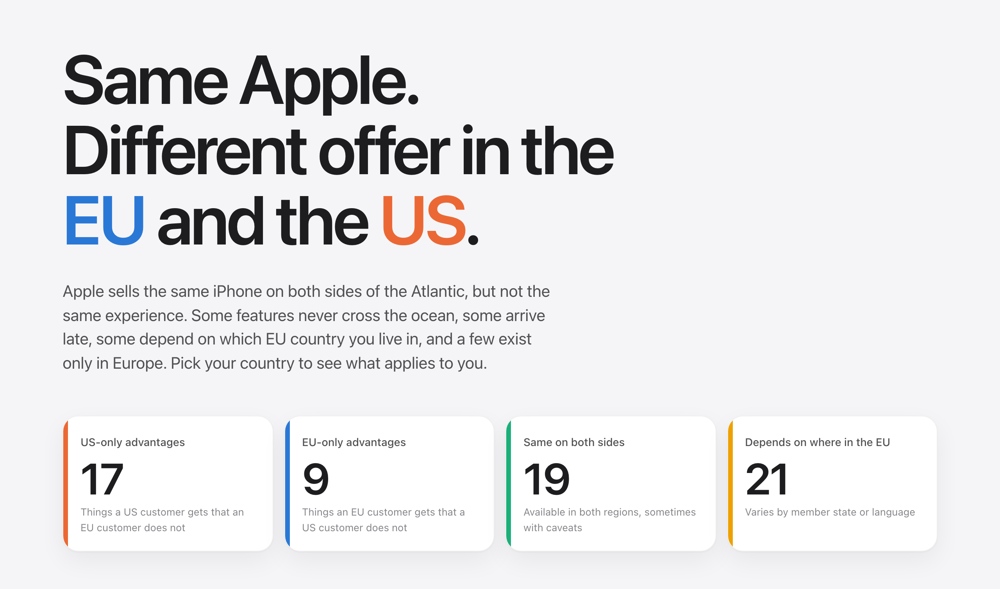

  

# Apple in the EU vs the US

**Live at [theotherapple.eu](https://theotherapple.eu/).**

Apple sells the same iPhone on both sides of the Atlantic, but not the same experience.
Some features never cross the ocean, some arrive late, some depend on which EU country
you live in, and a few exist only in Europe.

This is an interactive, sourced comparison of what an Apple customer gets in the
European Union versus the United States, written for anyone living in one of the 27
member states. Pick your country and the page resolves every "depends where you are"
item for you, checks Apple Intelligence against your language, and puts your local Apple
One tiers and iPhone price next to the US ones.

**Data as of 25 September 2026.** Every claim links to Apple's own support, product,
developer or legal pages, with the European Commission for the legal position.

## What's inside

- **Scorecard**: 66 documented differences across Apple Intelligence and Siri,
  subscriptions, app-store freedoms under the Digital Markets Act, satellite services,
  Wallet, health features, hardware and consumer rights. Each row shows both sides,
  who comes out ahead, the fine print, and its sources.
- **Country map**: a tile map of the EU you can paint with three dozen availability
  lists, from Fitness+ and satellite SOS to hearing-aid features and Apple Stores.
- **Language checker**: which of the 24 official EU languages Apple Intelligence, Siri,
  Live Translation and a dozen other language-gated features actually support.
- **Apple One and iPhone prices**: which tiers each country can buy and for how much,
  and an iPhone 18 Pro price explorer with VAT, US state sales tax and euro conversion
  under your control.
- **Timeline** of how the gap evolved, and a full source register.

## How to read it

- **Explicitly unavailable** means Apple states a restriction. **Not listed** means a
  country or language is missing from Apple's availability page.
- Prices are advertised standard prices in local currency. EU prices include VAT; US
  prices exclude sales tax, so the page lets you add the rate of any US state (default:
  the population-weighted US average), remove taxes on both sides, and convert to euros
  at the European Central Bank's twelve-month average rates.
- The site records what Apple publishes, not device tests. Eight things can change the
  answer for two people in the same city: device language, Siri language, device region,
  Apple Account country, physical location, content language, hardware and OS version,
  and the provider.

## Contributing

Spotted something wrong or out of date? Please [open an issue](https://github.com/watson/apple-eu/issues)
first, ideally with a link to the Apple page that shows the current position, before
sending a pull request. How to run the site locally, check the data and refresh the
snapshot is described in [CONTRIBUTING.md](CONTRIBUTING.md).

## License

Two licenses, because the repository holds two kinds of material:

- **Code** (JavaScript, CSS, HTML, scripts): [MIT](LICENSE).
- **Text and data** (editorial copy, `research/`, `data/`, `src/data/`): [CC BY 4.0](LICENSE-CONTENT).
  Reuse it however you like, with credit to Thomas Watson and a link back to this repository.

The underlying facts come from Apple's published pages, the European Central Bank and the
Tax Foundation and remain theirs; the licenses cover this project's selection, arrangement
and writing, not the third-party material itself.

Made by [Thomas Watson](https://wa.tson.dk). Not affiliated with or endorsed by Apple Inc.
